# Overview

Poo'd app is an online stool diary that enable users to log their daily stool and maintain gut health.

This app is made for everyone of all ages. Parents can use the app to log their newborn's stool and users with medical needs can use to monitor their gut health.

## Live App

https://pood-app.now.sh/

## API

https://github.com/nttran8/pood-server
https://frozen-dusk-57923.herokuapp.com

## Technology used

- HTML
- CSS
- Javascript
- React
- Express
- Node
- Knex
- PostgreSQL
- JSONWebtoken

## Screens

Users can register an account with a unique username
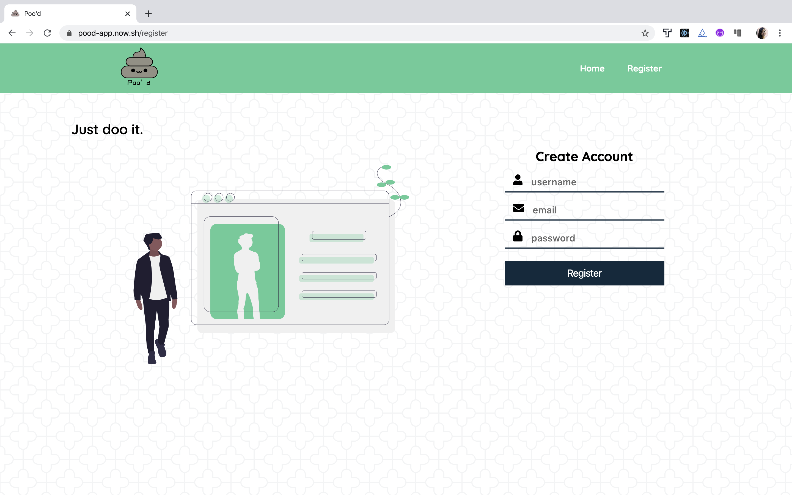
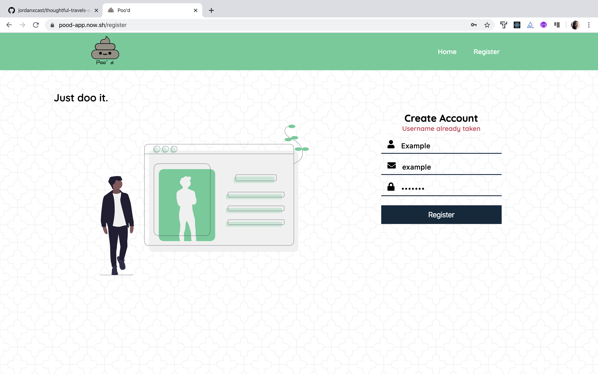
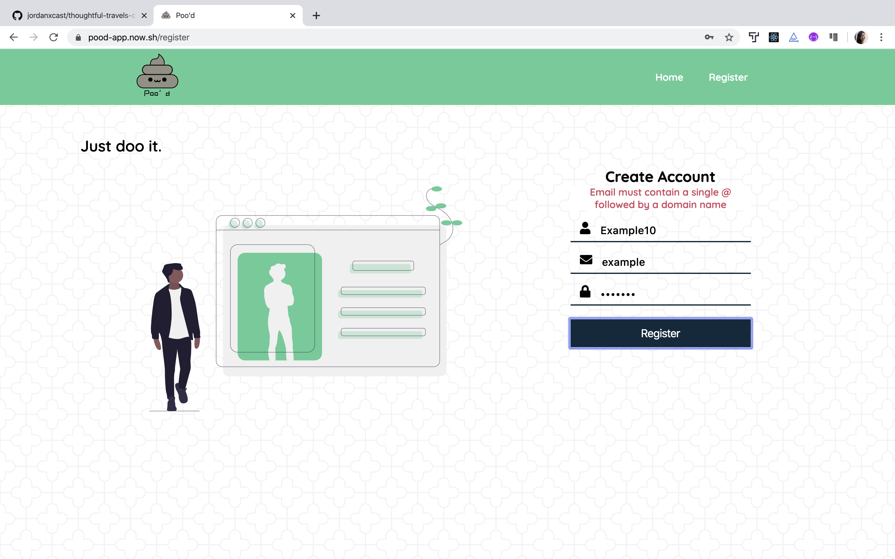
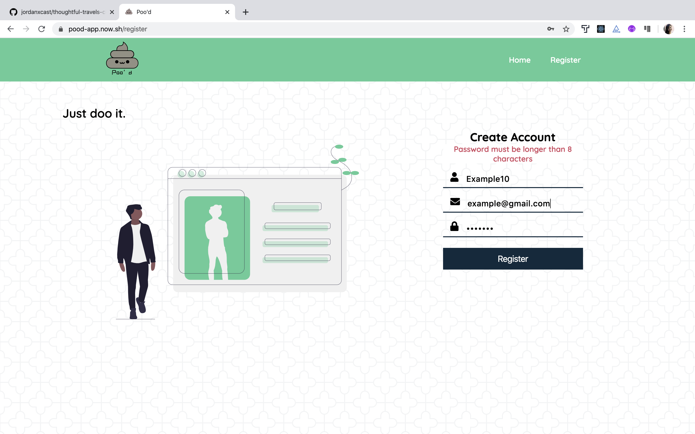
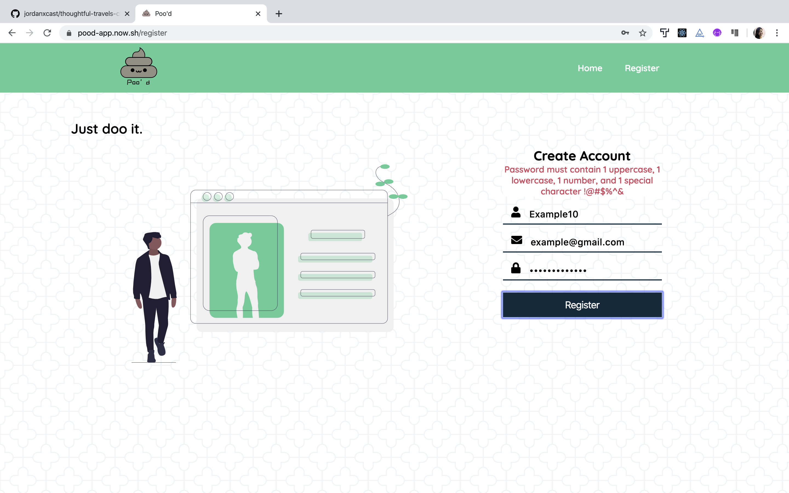

Users can log in with valid credentials
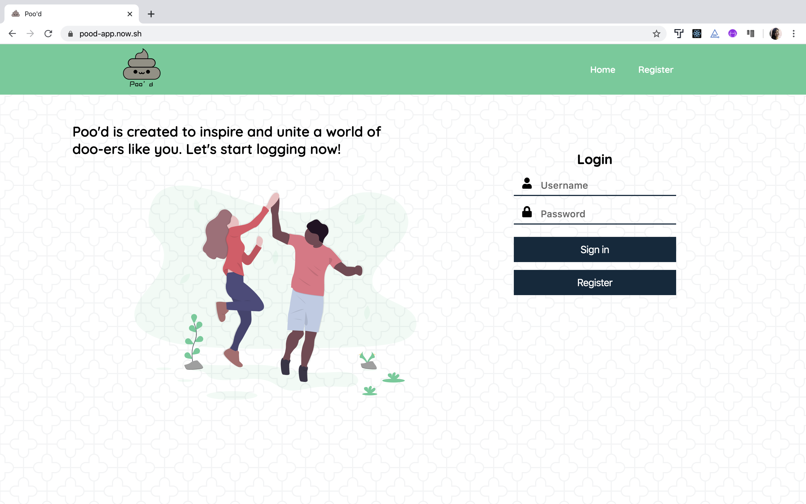
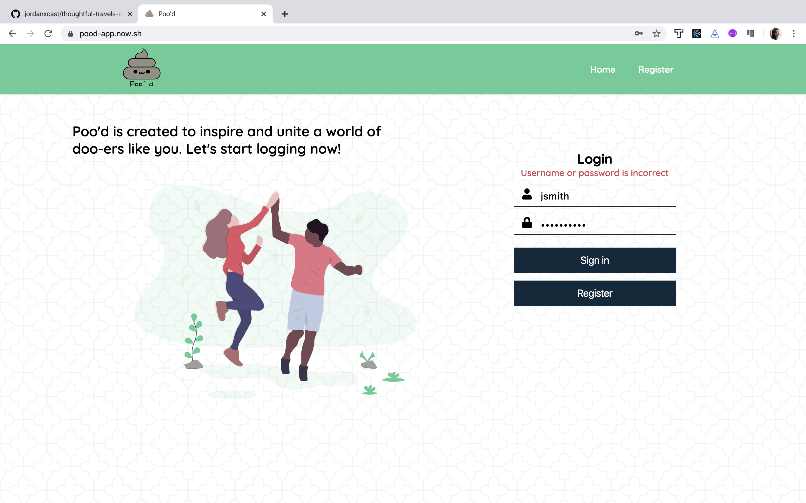

Users can view the dashboard
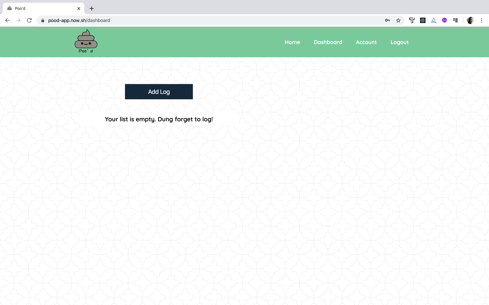

Users can add, delete, and update logs
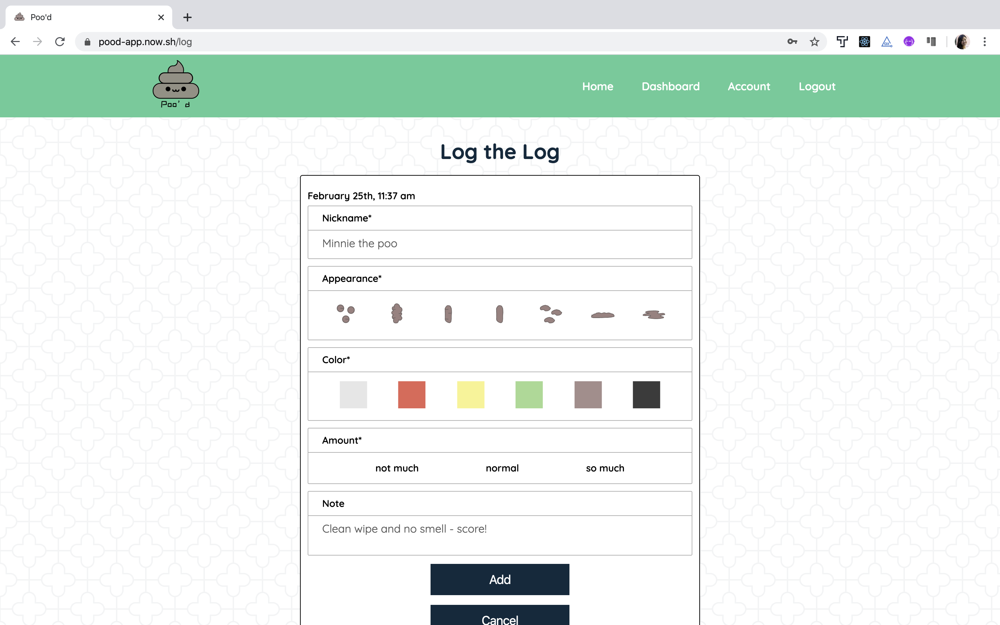
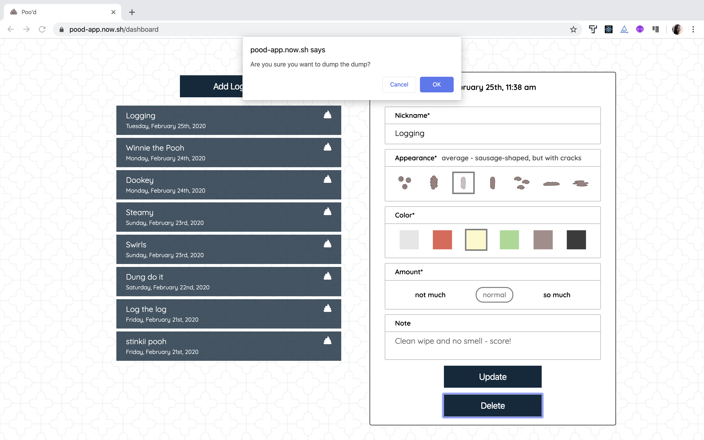
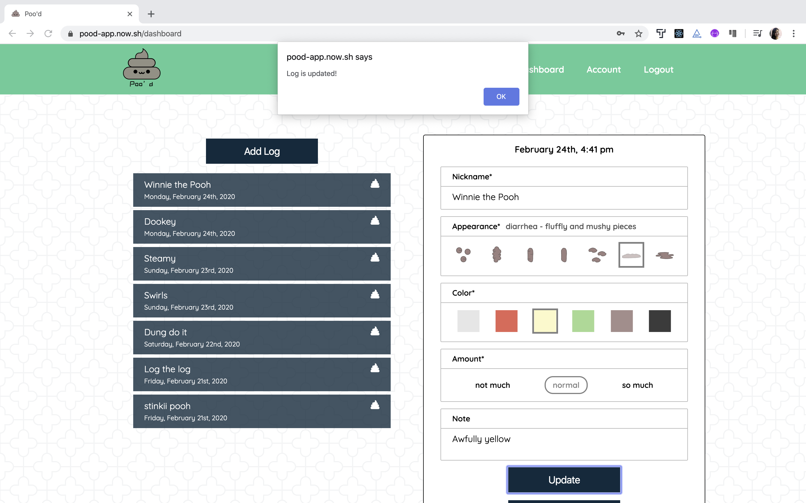
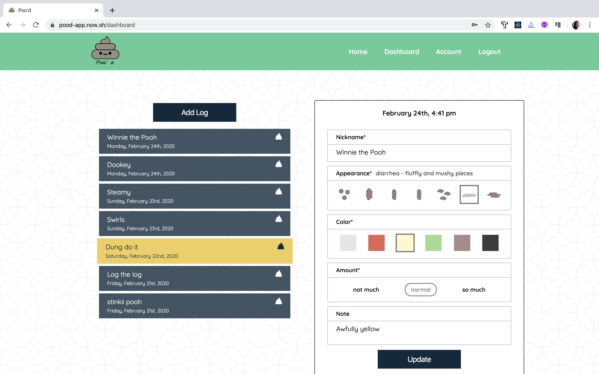

Users can view and update account information
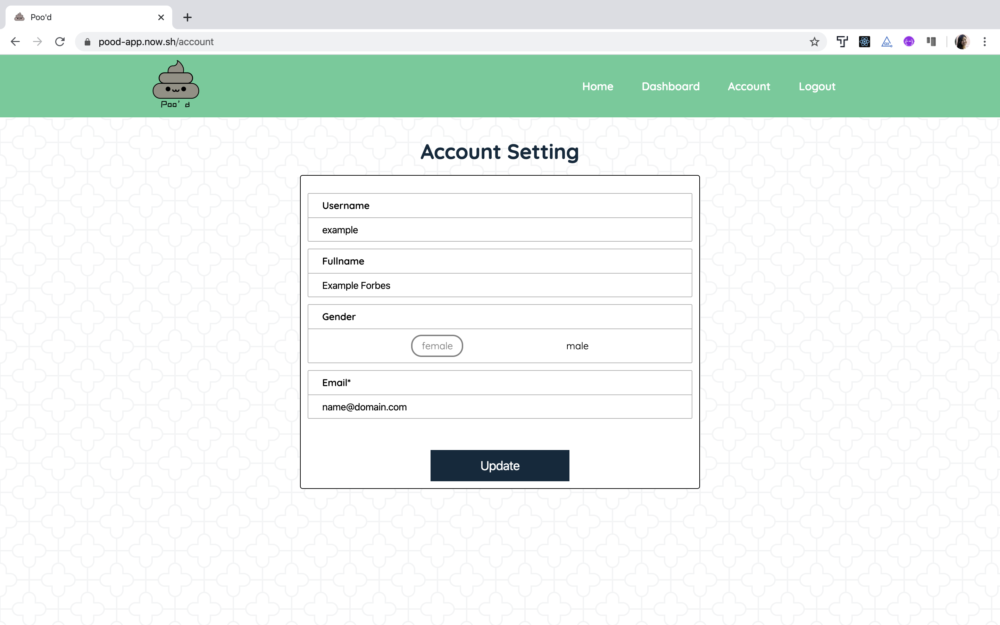
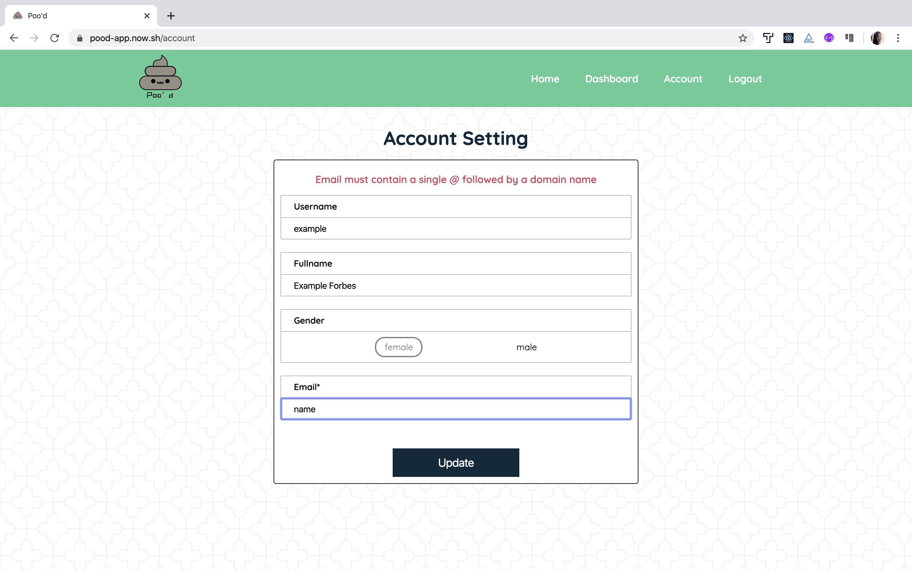
